# Knutr Architecture (Fresh Start)

This host implements a plugin-first, NL-fallback Slack bot. It favors clean message flow logs, rich metrics, and easy extensibility.

## Diagram

```mermaid
%%{init: {"flowchart": {"curve": "step", "htmlLabels": false}} }%%
flowchart LR
  subgraph SL_IN["**Slack**"]
    SI(["Events & Slash Webhooks"])
  end

  subgraph INGRESS["**Ingress & Translation**"]
    EP{{"Slack Webhook Endpoints (/events, /commands)"}}
    TR["SlackEventTranslator → MessageContext/CommandContext"]
  end

  subgraph CORE["**Core Orchestration** _plugin-first_"]
    EBI["EventBus — inbound"]
    ORCH["ChatOrchestrator"]
    RTE{{"CommandRouter"}}
    PLG["Plugin"]
    AR["AddressingRules _(NL fallback)_"]
    NL["NaturalLanguageEngine.GenerateAsync"]
    SP["ISystemPromptProvider"]
    LLM(["ILlmClient"])
    RS["IReplyService.SendAsync"]
    PROG["ProgressNotifier"]
    EBO["EventBus — outbound"]
  end

  subgraph OUTBOUND["**Slack Egress**"]
    OW(["SlackEgressWorker (subscribes outbound)"])
  end

  subgraph SL_OUT["**Slack**"]
    SO(["chat.postMessage / response_url / reactions"])
  end

  SI -.-> EP --> TR --> EBI --> ORCH
  ORCH --> RTE & PROG
  RTE -- "Matched" --> PLG
  RTE -- "NoMatch" --> AR
  PLG -- "Passthrough" --> RS
  PLG -- "Ask NL" --> NL
  AR --> NL
  NL --> SP & LLM & RS
  LLM --> NL
  RS --> EBO --> OW --> SO
```

## Design notes (lean)
- **Plugin-first:** if a command is registered for the event, route to it. Otherwise fall back to **AddressingRules → NL**.
- **ReplyService** owns delivery semantics; everything else yields a `Reply` + `ReplyHandle`.
- **EventBus** decouples ingress/orchestration from egress.
- **Observability:** OpenTelemetry metrics/traces; Serilog logs at **Information** for `Knutr.*`, `Warning` for everything else.
